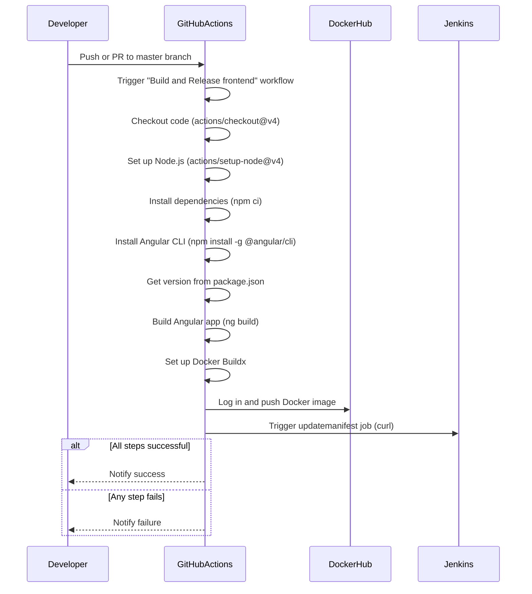

# EcommerceFrontendWebApp

This is the frontend web application for the [ecommerce project](https://github.com/FelipeBarretoB/ecommerce-microservice-backend-app). This application was forked from [this repository](https://github.com/SelimHorri/ecommerce-frontend-web-app) and as it discussed in the ecomerce project read me
Our project was first and for most a DevOps project and we spent most of out time making pipelines.

Having said that, we just got the frontend working at the most minimal level, we don't promise much will work, but again, we focused in pipelines.

## important

To use this frontend, add your ip/address to the [this file](./src/environments/environment.prod.ts) for production and [this file](./src/environments/environment.ts) for development.

## pipeline 

We use a pipeline to build each new image and push it to the registry. however, when ever you want to do that, pls change the version in the [package.json](./package.json) file, so that the pipeline will build a new image.

This pipeline also triggers a jenkins pipeline for gitOps, which later updates an argoscd present in azure. You can find the jenkins pipeline [here](https://github.com/FelipeBarretoB/ecommerce-kubernetes-manifest)

Heres a diagram of the pipeline:

